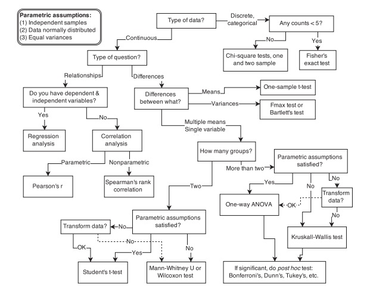
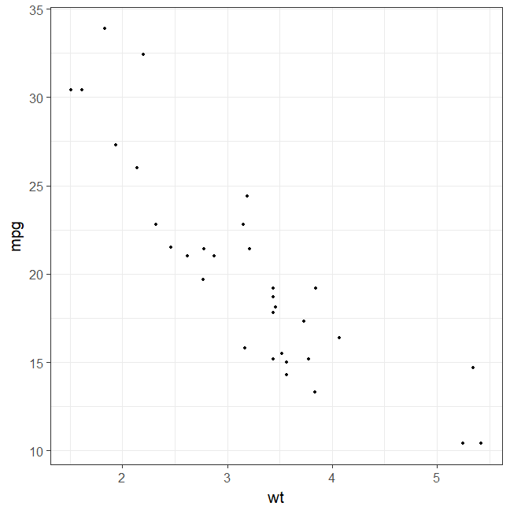
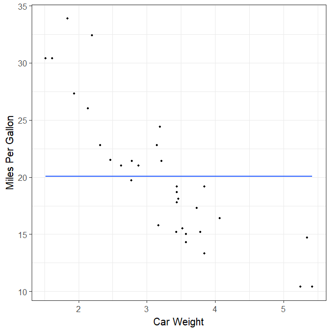
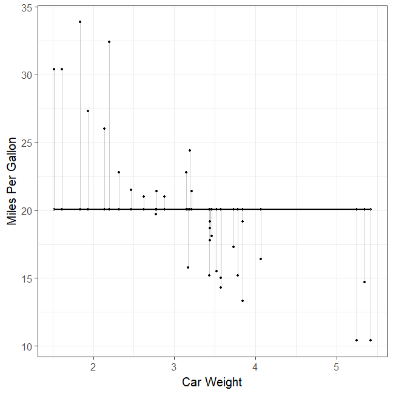
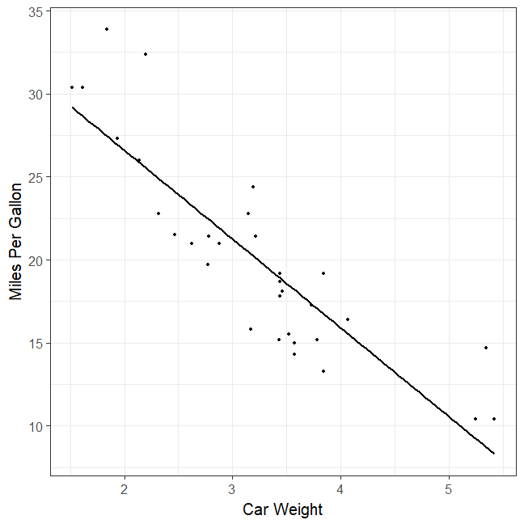
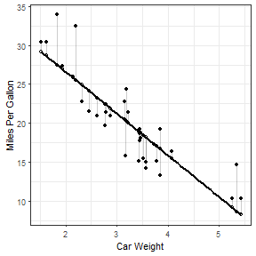
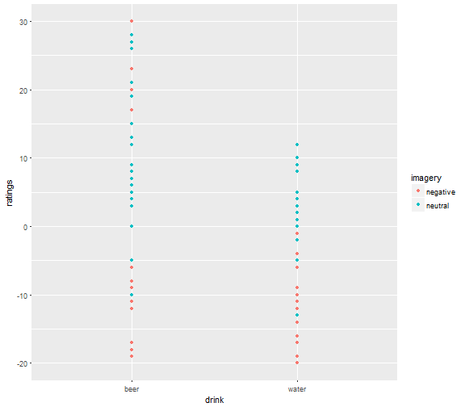
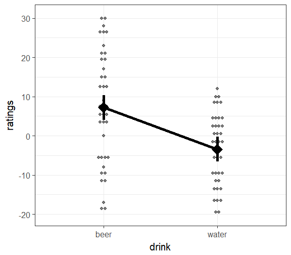

Model comparison approach to ANOVA
========================================================
author: Ivan Grahek
date: Ghent University (Belgium)
autosize: true
transition: none
width: 1600
height: 1000
css: css-file.css

Contents
========================================================
incremental: true
type: lineheight

- Model comparison approach to data analysis
- Regression 101 (2 continuous variables)
- Regression with categorical variables
- Model comparison approach to ANOVA


The standard way: IF-THEN cookbook
========================================================
incremental: true
type: lineheight

<div align = "center" style="float: bottom;">

</div>

The model comparison approach: Regressions all the way down
========================================================
incremental: true
type: lineheight

<div align = "center" style="float: bottom;">

</div>

The model comparison approach
========================================================
incremental: true
type: lineheight

- Most of the analyses can be viewed as linear regressions
- t-test: two-level categorical variable as the predictor
- ANOVA: three-or-more-level categorical variable as the predictor
- Good introductions: 
    - Judd, McClelland, & Ryan (1989; 2017 - 3rd edition)
    - McElreath (2015)

What is a model?
========================================================
incremental: true
type: lineheight

<div align = "center" style="float: bottom;">

</div>

Compact description of data

Each of the cookbook procedures contains off-the-shelf models hidden inside

Here we will try to open these pasta machines 

Simple regression
========================================================
incremental: true
type: lineheight

What is a linear model?

$$
\begin{align}
\text{DATA} = \text{MODEL} + \text{ERROR} \\ 
\end{align}
$$

We will write this down as:

$$
\begin{align}

\mathcal y_{i} &\sim \mathrm{Normal}(\mu_{i},\sigma) \\
\mu_{i} &= \alpha + \beta_{1}x_{i} \\

\end{align}
$$


Simple regression
========================================================
incremental: true
type: lineheight

How do we write this in R?

$$
\begin{align}

\mathcal y_{i} &\sim \mathrm{Normal}(\mu_{i},\sigma) \\
\mu_{i} &= \alpha + \beta_{1}x_{i} \\

\end{align}
$$


```r
model <- lm(y ~ 1 + x, data = d)
```

Simple regression
========================================================
incremental: true
type: lineheight

$$
\begin{align}
\mathcal y_{i} &\sim \mathrm{Normal}(\mu_{i},\sigma) \\
\mu_{i} &= \alpha + \beta_{1}x_{i} \\
\end{align}
$$

Our goal is always to estimate these parameters:

$$
\begin{align}

\alpha\\
\beta_{1}\\

\end{align}
$$

How do we do this and what does it mean?

Let's get some data
========================================================
incremental: true
type: lineheight

Here is some fascinating data on properties of cars


```r
attach(mtcars)
d <- mtcars
head (d)
```

```
                   mpg cyl disp  hp drat    wt  qsec vs am gear carb
Mazda RX4         21.0   6  160 110 3.90 2.620 16.46  0  1    4    4
Mazda RX4 Wag     21.0   6  160 110 3.90 2.875 17.02  0  1    4    4
Datsun 710        22.8   4  108  93 3.85 2.320 18.61  1  1    4    1
Hornet 4 Drive    21.4   6  258 110 3.08 3.215 19.44  1  0    3    1
Hornet Sportabout 18.7   8  360 175 3.15 3.440 17.02  0  0    3    2
Valiant           18.1   6  225 105 2.76 3.460 20.22  1  0    3    1
```

Let's plot the data
========================================================
incremental: true
type: lineheight

A simple scatterplot


```r
# Basic scatter plot
ggplot(mtcars, aes(x=wt, y=mpg)) + 
  geom_point() + # Data points
  theme_bw(base_size = 20) # Theme
```



Fitting the simplest line 
========================================================
incremental: true
type: lineheight

$$
\begin{align}
\mathcal y_{i} &\sim \mathrm{Normal}(\mu_{i},\sigma) \\
\mu_{i} &= \alpha \\
\end{align}
$$


```r
# Basic scatter plot
ggplot(mtcars, aes(x=wt, y=mpg)) + 
  geom_point() + # Data points
  labs(x="Car Weight", y = "Miles Per Gallon") + # Name the axes
  theme_bw(base_size = 20) + # Theme for the plot
  geom_smooth(method = lm, se=FALSE, formula = y ~ 1)  # Regression line
```



How bad is the line? 
========================================================
incremental: true
type: lineheight

$$
\begin{align}
\mathcal y_{i} &\sim \mathrm{Normal}(\mu_{i},\sigma) \\
\mu_{i} &= \alpha \\
\end{align}
$$


```r
model = lm(mpg ~ 1, data = mtcars)
d$predicted <- predict(model)   # Save the predicted values
d$residuals <- residuals(model) # Save the residual values

# Quick look at the actual, predicted, and residual values
library(tidyverse)
d %>% select(mpg, predicted, residuals) %>% sample_n(10)
```

```
                    mpg predicted residuals
Volvo 142E         21.4  20.09062  1.309375
Pontiac Firebird   19.2  20.09062 -0.890625
Merc 280C          17.8  20.09062 -2.290625
Hornet 4 Drive     21.4  20.09062  1.309375
Mazda RX4 Wag      21.0  20.09062  0.909375
Cadillac Fleetwood 10.4  20.09062 -9.690625
Chrysler Imperial  14.7  20.09062 -5.390625
Merc 230           22.8  20.09062  2.709375
AMC Javelin        15.2  20.09062 -4.890625
Camaro Z28         13.3  20.09062 -6.790625
```
How bad is the line? 
========================================================
incremental: true
type: lineheight

$$
\begin{align}
\mathcal y_{i} &\sim \mathrm{Normal}(\mu_{i},\sigma) \\
\mu_{i} &= \alpha \\
\end{align}
$$


```r
ggplot(d, aes(x = wt, y = mpg)) +
  geom_smooth(method = lm, se = FALSE, formula = y ~ 1, color = "black") +  # Regression line
  geom_segment(aes(xend = wt, yend = predicted), alpha = .2) +  # Connect predicted and actual values
  geom_point() + # Data points
  geom_point(aes(y = predicted), shape = 1) + #Points for values predicted by the model
  xlab("Car Weight") + # X-axis
  ylab("Miles Per Gallon") + # Y-axis
  theme_bw(base_size = 20)  # Theme for the plot
```



What does our model think? 
========================================================
incremental: true
type: lineheight

$$
\begin{align}
\mathcal y_{i} &\sim \mathrm{Normal}(\mu_{i},\sigma) \\
\mu_{i} &= \alpha \\
\end{align}
$$


```r
model = lm(mpg ~ 1, data = mtcars)
summary(model)
```

```

Call:
lm(formula = mpg ~ 1, data = mtcars)

Residuals:
    Min      1Q  Median      3Q     Max 
-9.6906 -4.6656 -0.8906  2.7094 13.8094 

Coefficients:
            Estimate Std. Error t value Pr(>|t|)    
(Intercept)   20.091      1.065   18.86   <2e-16 ***
---
Signif. codes:  0 '***' 0.001 '**' 0.01 '*' 0.05 '.' 0.1 ' ' 1

Residual standard error: 6.027 on 31 degrees of freedom
```

Fitting the second simplest line
========================================================
incremental: true
type: lineheight

$$
\begin{align}
\mathcal y_{i} &\sim \mathrm{Normal}(\mu_{i},\sigma) \\
\mu_{i} &= \alpha + \beta_{1}x_{i} \\
\end{align}
$$


```r
attach(mtcars) # Take the data
# Basic scatter plot
ggplot(mtcars, aes(x=wt, y=mpg)) + 
  geom_point() + # Data points
   # Regression line
  labs(x="Car Weight", y = "Miles Per Gallon") + # Name the axes
  theme_bw(base_size = 20) + # Theme for the plot
  geom_smooth(method = lm, se=FALSE, color = "black", formula = y ~ 1 + x) # Regression line
```



How bad is the line? 
========================================================
incremental: true
type: lineheight

$$
\begin{align}
\mathcal y_{i} &\sim \mathrm{Normal}(\mu_{i},\sigma) \\
\mu_{i} &= \alpha + \beta_{1}x_{i} \\
\end{align}
$$


```r
model <- lm(mpg ~ 1 + wt, data = mtcars)
  
d$predicted <- predict(model)   # Save the predicted values
d$residuals <- residuals(model) # Save the residual values

# Quick look at the actual, predicted, and residual values
library(tidyverse)
d %>% select(mpg, predicted, residuals) %>% sample_n(10)
```

```
                   mpg predicted  residuals
Honda Civic       30.4 28.653805  1.7461954
AMC Javelin       15.2 18.926866 -3.7268663
Lotus Europa      30.4 29.198941  1.2010593
Hornet Sportabout 18.7 18.900144 -0.2001440
Mazda RX4 Wag     21.0 21.919770 -0.9197704
Duster 360        14.3 18.205363 -3.9053627
Camaro Z28        13.3 16.762355 -3.4623553
Toyota Corolla    33.9 27.478021  6.4219792
Merc 280          19.2 18.900144  0.2998560
Chrysler Imperial 14.7  8.718926  5.9810744
```
How bad is the line? 
========================================================
incremental: true
type: lineheight

$$
\begin{align}
\mathcal y_{i} &\sim \mathrm{Normal}(\mu_{i},\sigma) \\
\mu_{i} &= \alpha + \beta_{1}x_{i} \\
\end{align}
$$


```r
ggplot(d, aes(x = wt, y = mpg)) +
  geom_smooth(method = lm, se = FALSE, color = "black", formula = y ~ 1 + x) +  # Regression line
  geom_segment(aes(xend = wt, yend = predicted), alpha = .2) +  # Connect predicted and actual values
  geom_point() + # Data points
  geom_point(aes(y = predicted), shape = 1) + #Points for values predicted by the model
  xlab("Car Weight") + # X-axis
  ylab("Miles Per Gallon") + # Y-axis
  theme_bw()  # Theme for the plot
```



What does our model think? 
========================================================
incremental: true
type: lineheight

$$
\begin{align}
\mathcal y_{i} &\sim \mathrm{Normal}(\mu_{i},\sigma) \\
\mu_{i} &= \alpha + \beta_{1}x_{i} \\
\end{align}
$$


```r
model = lm(mpg ~ 1 + wt, data = mtcars)
  
summary(model)
```

```

Call:
lm(formula = mpg ~ 1 + wt, data = mtcars)

Residuals:
    Min      1Q  Median      3Q     Max 
-4.5432 -2.3647 -0.1252  1.4096  6.8727 

Coefficients:
            Estimate Std. Error t value Pr(>|t|)    
(Intercept)  37.2851     1.8776  19.858  < 2e-16 ***
wt           -5.3445     0.5591  -9.559 1.29e-10 ***
---
Signif. codes:  0 '***' 0.001 '**' 0.01 '*' 0.05 '.' 0.1 ' ' 1

Residual standard error: 3.046 on 30 degrees of freedom
Multiple R-squared:  0.7528,	Adjusted R-squared:  0.7446 
F-statistic: 91.38 on 1 and 30 DF,  p-value: 1.294e-10
```

Models with categorical predictors
========================================================
incremental: true
type: lineheight

- Buliding a regression with a categorical predictor
- This is the case of a t-test

- Let's get take the data from the first lecture
========================================================
incremental: true
type: lineheight

Beer vs. water & positive vs. negative dataset


```r
d = read.csv(file = "C:/Users/igrahek/Documents/Conferences/Bayes specialist course, Gent, 2018/Model comparison lecture/data_attitude.csv")
head (d)
```

```
  participant    sex drink  imagery ratings
1           1 female  beer negative       6
2           2 female  beer negative      30
3           3 female  beer negative      15
4           4 female  beer negative      30
5           5 female  beer negative      12
6           6 female  beer negative      17
```

Let's plot the data
========================================================
incremental: true
type: lineheight

A simple scatterplot


```r
library(tidyverse)
ggplot(d, aes(x = drink, y = ratings, color = imagery)) +
    geom_point()  #+
```



```r
    #geom_line(aes(group = imagery)) #+
    #geom_smooth(method=lm, se=FALSE) 

d %>%
    ggplot(aes(x = drink, y = ratings) ) +
    # adding individual data points
    geom_dotplot(binaxis = "y", stackdir = "center", alpha = 0.5, dotsize = 0.5) +
    # adding model predictions
    
    theme_bw(base_size = 20)
```


Contrast and dummy coding
========================================================
incremental: true
type: lineheight

Intercept is the average of one group vs. Intercept is the average of both groups

Fitting our model
========================================================
incremental: true
type: lineheight

$$\large y = \alpha + \beta_1 * x$$


```r
model = lm(ratings ~ 1 + drink, data = d)

d %>%
    # predictions of model 1
    mutate(
        p = predict(model, interval = "confidence", level = 0.90)[, 1],
        lwr = predict(model, interval = "confidence", level = 0.90)[, 2],
        upr = predict(model, interval = "confidence", level = 0.90)[, 3]
        ) %>%
    ggplot(aes(x = drink, y = ratings) ) +
    # adding individual data points
    geom_dotplot(binaxis = "y", stackdir = "center", alpha = 0.5, dotsize = 0.5) +
    # adding model predictions
    geom_point(aes(y = p), shape = 18, size = 10, show.legend = FALSE) +
    geom_errorbar(aes(ymin = lwr, ymax = upr), width = 0, size = 2, show.legend = FALSE) +
    geom_line(aes(y = p, group = imagery), size = 2, show.legend = FALSE) +
   theme_bw(base_size = 20)
```



How bad is the line? 
========================================================
incremental: true
type: lineheight

$$\large y = \alpha + \beta_1 * x$$


What does our model think?
========================================================
incremental: true
type: lineheight

$$\large y = \alpha + \beta_1 * x$$


How much does our model miss?
========================================================
incremental: true
type: lineheight

$$\large y = \alpha + \beta_1 * x$$


<script src="https://ajax.googleapis.com/ajax/libs/jquery/3.1.1/jquery.min.js"></script>
<script>

for(i=0;i<$("section").length;i++) {
if(i==0) continue
$("section").eq(i).append("<p style='font-size:xx-large;position:fixed;right:30px;bottom:30px;'>" + i + "</p>")
}

</script>
